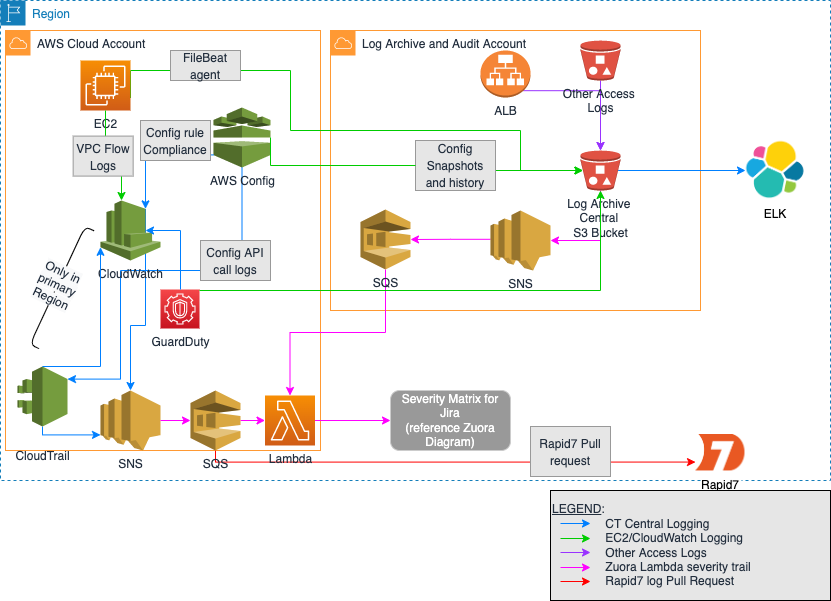

# CT_R7

template for setting up cloudtrail with an S3 bucket, SNS topic, and SQS to setup for Rapid7 log pull.

## About This Module

This Module implements and enables a Cloudtrail at the root level. This code sets up a Log group for the logs as well as an S3 bucket, SNS topic, and SQS. These are set up to collect logs and allow Rapid7 to be setup to pull the logs from SQS.

## Brief Description on Setup

- A CloudTrail is enabled and setup with the name provide int he variables int he main.tf.
- The log group is setup and the attached tot he Cloud Trail.
- An S3 bucket is setup with the variables provided int he main.tf and connected to the log group for collecting the logs from CloudTrail.
- SNS topic is setup with the name provided int he variables. and is subscribed tot he SQS that is setup.


## How to Use This Module

- This module can be used in any AWS environment although it is setup specifcally targeting ingestion from Rapid7
- The account used to deploy this module should have rights to assume the right account to allow for creating services/objects.
- Must have a way to deploy Terraform code.
- Change the variables in the main.tf:
```

module "cloudtrail" {
  source               = "./modules/cloud-trail"
  terraform_queue_name = "r7_queue"
  sns_topic_name       = "r7_topic"
  sns_protocol         = "sqs"
  bucket_name          = "cloudtrail-r7-logs"
  trail_name           = "EventsTrail"
  log_group_name       = "logs"
  tags = {
    "Workload Name"         = "" #Update with tag name (add confluence link to mandatory tags)
    "Application Name"      = "" #Update with tag name (add confluence link to mandatory tags)
    "Environment"           = "" #Update with tag name (add confluence link to mandatory tags)
    "Business Unit"         = "" #Update with tag name (add confluence link to mandatory tags)
    "Operations Commitment" = "" #Update with tag name (add confluence link to mandatory tags)
    "Operations Team"       = "" #Update with tag name (add confluence link to mandatory tags)
    "Business Criticality"  = "" #Update with tag name (add confluence link to mandatory tags)
    "Data Classification"   = "" #Update with tag name (add confluence link to mandatory tags)
    "Disaster Recovery"     = "" #Update with tag name (add confluence link to mandatory tags)
  }
}


```
- Run `terraform init` and `terraform apply`
Follow prompts to deploy the IaC (Infrstructure as Code) to your AWS environment.


## Log Flow Diagram


